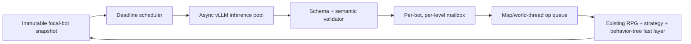

# LLM Control Architecture for a Handful of Playerbots

## Executive recommendation

The LLM should steer an explicitly allowlisted **1–8 focal bots**. The other approximately 1,500 server-side bots remain entirely on the existing personality/dial, RPG, strategy, and behavior-tree systems. This distinction changes the capacity question dramatically: output-token throughput is ample for several simultaneous control loops on every focal bot. It does **not** remove the latency problem. A structured decision still arrives roughly 1.5–4 seconds after its snapshot, spanning many server ticks and potentially several AI updates.

Build these two levels first:

1. **Disposition/dial nudging**, event-driven and roughly every 30–120 minutes as a baseline.
2. **Goal/activity selection**, event-driven and roughly every 5–20 minutes as a baseline.

They provide the highest-value use of personality and memory while leaving execution to proven systems. After those work, trial **tactical directives** at 5–15 second cadence for the focal bots. With only eight bots, this is affordable; it must still be advisory, short-lived, and rejected when stale. Do **not** build action-level puppeteering merely because eight bots fit the throughput budget. Throughput answers “can requests be generated?” Latency answers “will the answer still be valid?” At 1.5–4 seconds, direct combat/action decisions remain stale relative to 50–100 ms ticks and 0.5–3 second AI updates.

The architecture is hierarchical and non-blocking:

Inference workers may read immutable snapshots and publish proposed decisions. **Only the owning map/world thread may revalidate current preconditions and apply queued operations.** No inference future is awaited from an AI update, map update, or world tick. The focal bots remain fully functional when inference is absent.

## 1. Taxonomy: how far into the loop the LLM belongs

### Capacity assumptions and arithmetic

Measured generation rates:

- Concurrency 1: **73.7 output tokens/s**.
- Concurrency 32: **1,135 aggregate output tokens/s**.
- Structured-decision wall latency: approximately **1.5–4 seconds**.
- Maximum in-flight sequences: **32**.

For output budget $T$ tokens and cadence $C$ seconds:

$$
\text{token-limited decisions/s}=R/T
$$

$$
\text{token-limited bots at cadence }C=RC/T
$$

At 32 concurrent sequences, latency independently limits completions to:

$$
32/L=8\text{ to }21.3\text{ decisions/s},\quad L\in[4,1.5]\text{ s}
$$

The safe capacity is the lesser of token capacity and the slot/latency capacity. These calculations concern output generation. Unique input prefill and KV-cache occupancy still matter; prefix caching makes the stable shared prefix cheap but not each bot-specific suffix.

| Loop placement, slowest to fastest | Cadence | Output budget | C1 token capacity | C32 token capacity | Slot/latency ceiling | Cost for 8 focal bots | Risk to fast layer | What it adds beyond the slower level |
|---|---:|---:|---:|---:|---:|---:|---|---|
| **A. Offline biography / retrospective** | Daily or at a material life chapter | **600 tokens** | $73.7/600=0.123$/s, or 10,613 bots/day | $1,135/600=1.892$/s, or 163,440 bots/day | 691k–1.84m requests/day; token-bound | 4,800 tokens/day; about **4.2 aggregate-generation seconds/day** at 1,135 tok/s | Very low if biography cannot mutate live state | Compresses old ledger history into persistent narrative continuity; gives later loops a compact memory view |
| **B. Disposition / dial nudging** | 60 min baseline; use **30 min** stress cadence | **80 tokens** | $73.7/80=0.921$/s; 1,658 bots/30 min | $1,135/80=14.19$/s; 25,538 bots/30 min | 14,400–38,400 bots/30 min | $8\times80/1,800=0.356$ tok/s, **0.031%** of aggregate throughput | Low with bounded, decaying deltas | Converts remembered experience into temporary mood, sociability, courage, PvP appetite, persistence, or activity weighting |
| **C. Goal / macro-activity selection** | **5 min** stress cadence; usually 5–20 min or on completion/failure | **100 tokens** | $73.7/100=0.737$/s; 221 bots/5 min | $1,135/100=11.35$/s; 3,405 bots/5 min | 2,400–6,400 bots/5 min | $8\times100/300=2.67$ tok/s, **0.24%** of aggregate throughput | Low–medium; only choose among feasible candidates | Adds coherent intent—quest, grind, PvP, socialize, rest, wander, camp—and makes personality/history visibly affect a bot's life |
| **D. Tactical directive** | **5–15 s** while active; use 5 s stress cadence | **80 tokens** | $73.7/80=0.921$/s; 4.6 bots at 5 s | $1,135/80=14.19$/s; 70.9 bots at 5 s | 40–106.7 bots at 5 s; token-bound gives 70.9 | At 5 s: $8\times80/5=128$ tok/s, **11.3%** of aggregate; 1.6 req/s | Medium–high; stale directives may fight combat/BG logic | Adds short-lived posture—engage/avoid, hold/push/regroup, protect/follow—without selecting spells, paths, or frame-level targets |
| **E. Action-level puppeteering** | Every decision, nominally **1 s** | **40 tokens** | $73.7/40=1.84$/s: 1.84 bots at 1 s | $1,135/40=28.38$/s: 28.4 bots at 1 s | **8–21.3 bots at 1 s**; latency/slots bind at the slow end | $8\times40=320$ tok/s, **28.2%** of aggregate; 8 req/s exactly saturates the 32-slot ceiling at 4 s | Extreme despite affordable tokens | Adds direct action/spell/target choice, but little useful value because the existing tree has much fresher state and domain-valid actions |

For eight bots, every level is output-token-affordable. Even an intentionally aggressive combined workload per bot—80 tokens/30 min for disposition, 100/5 min for macro, 80/5 s for tactics, and 40/1 s for action—costs:

$$
0.044+0.333+16+40=56.38\text{ tokens/s per bot}
$$

or:

$$
8\times56.38=451\text{ tokens/s}
$$

which is only 39.7% of 1,135 aggregate tok/s. But it produces $8(1+0.2+1/300+1/1800)=9.63$ requests/s. At 4 seconds per decision, 32 slots sustain only 8 requests/s, so the requests queue even though output-token capacity is spare. More importantly, each action answer is already 1.5–4 action periods old. Capacity therefore permits richer slow-loop reasoning and frequent tactical advice, not safe reflex replacement.

Biography may use more output because it is rare. Do not recursively feed unlimited generated prose back into the model. Store a compact canonical summary, retain authoritative ledger facts, and prevent narrative self-conditioning from turning inference into invented history.

## 2. Steering granularity: ownership boundary

### The LLM should own

- **Interpretation across slow signals:** 33-axis facets, computed dials, life events, grudges, gear taste, relationship changes, and recent success/failure.
- **Bounded disposition deltas:** small temporary changes to allowed overlays, with duration and a compact reason code.
- **Choice among feasible macro goals:** select candidate IDs supplied by deterministic code rather than invent commands, places, or quest identifiers.
- **Short-lived intent for focal bots:** a tactical posture or objective preference where an existing deterministic strategy adapter can implement it.
- **Narrative compression:** summarize older events into stable, compact memories while treating the raw ledger as authoritative.
- **Abstention:** return `keep_current` when the current intent remains suitable or evidence is weak.

### The behavior tree and deterministic substrate must keep

- Movement, navigation, travel, mounts, transports, map transitions, and unsticking.
- Combat rotations, spell legality, cooldown/resource handling, target validation, interrupts, dispels, consumables, threat, positioning, and survival reflexes.
- Moment-to-moment BG mechanics and tactics dependent on rapidly changing positions/objectives.
- Group protocol, command authority, quest prerequisites, inventory operations, loot rules, and transactional changes.
- Feasibility, safety, and policy checks; strategy activation/deactivation; fallback behavior.
- Everything required for normal operation while vLLM is slow, unavailable, or returning rejected decisions.

### Latency, not throughput, determines the boundary

A 1.5–4 second response spans:

- **15–80 server ticks** at 50–100 ms per tick.
- Roughly **0.5–8 bot AI update intervals** at 0.5–3 seconds per update.

The LLM can therefore own intent with a useful half-life of minutes or hours. It may advise on tactics whose validity is explicitly checked and whose failure is harmless. It must not own reflexes whose truth changes during one combat exchange.

The control composition is:

1. LLM selects a bounded intent from current candidates.
2. The map/world thread validates that intent against current state.
3. Existing systems decide how to execute it.
4. If it is late, invalid, expired, absent, or contradicted by higher authority, existing logic continues unchanged.

For tactics, select adapters such as `defensive`, `objective_push`, or `protect_ally`; do not emit arbitrary strategy names, raw GUIDs, spell IDs, paths, coordinates, or command strings. Candidate IDs are capabilities, not suggestions: if an adapter is not offered, the model cannot request it.

### Why direct action control is still the wrong goal

Eight bots fit the measured output budget at one 40-token decision per second, but a one-second action cadence plus 1.5–4 second latency means several newer state transitions occur before application. Speculative parallel requests would worsen coherence: multiple responses derived from different snapshots would race, require aggressive invalidation, and waste slots. Predicting a multi-second action plan also fails because combat branches after every movement, proc, interrupt, target change, or player action. The mature behavior tree is both faster and more grounded. Use spare capacity to improve context, evaluate alternatives, or refresh tactical intent—not to increase the authority of stale output.

## 3. Per-bot attention and use of 32 concurrent slots

The scheduling problem is no longer fair allocation across 1,500 LLM-controlled bots. Only 1–8 focal bots are eligible. The problem becomes **coordinating several loop levels per bot without allowing stale or low-value requests to crowd out salient ones**.

### Run multiple levels simultaneously—but isolate their authority

Each focal bot may have independent loop state for:

- Biography compression: rare, low priority.
- Disposition: hourly/event-driven.
- Macro goal: minutes/event-driven.
- Tactical directive: seconds/event-driven while active.

Use one mailbox and at most one in-flight request **per bot per loop level**, not merely one request per bot. This lets a macro reconsideration proceed while a tactical directive is in flight, because they produce separate, composable outputs. Do not run multiple simultaneous requests for the same bot and same level; coalesce newer events into one next snapshot. Every result carries its level, snapshot ID, state generation, and TTL.

With eight bots and 32 slots, the nominal ceiling is **four in-flight sequences per bot**, exactly enough for one biography, disposition, macro, and tactical request each. This is a ceiling, not a reservation. Biography should never occupy a slot needed by live decisions, and normal operation will use far fewer than 32 sequences.

### Recommended slot policy

Use deadline scheduling with soft class reservations and immediate borrowing:

- **16 slots tactical:** at most two potentially relevant live requests per focal bot in aggregate, though still only one per bot at the tactical level; spare slots are borrowable.
- **8 slots macro:** enough for simultaneous reconsideration by all eight bots after a shared event.
- **4 slots disposition:** slow work can queue briefly without harm.
- **2 slots biography/maintenance.**
- **2 slots recovery/canary headroom.**

Because a single level permits only one in-flight request per bot, the tactical class normally consumes at most eight slots. The extra soft reservation is burst/headroom, not permission to issue speculative duplicate requests. Work-conserving borrowing keeps the GPU occupied when useful work exists.

### Cadence budget for all eight bots

A rich recommended workload is:

| Level | Cadence | Output tokens | Eight-bot demand |
|---|---:|---:|---:|
| Disposition | 30 min stress cadence | 80 | 0.0044 req/s; 0.36 tok/s |
| Macro | 5 min stress cadence | 100 | 0.0267 req/s; 2.67 tok/s |
| Tactical | 5 s while all active | 80 | 1.6 req/s; 128 tok/s |
| Biography | daily | 600 | negligible steady rate; 4,800 tokens total |

Excluding the one-time biography burst, this is only **1.63 requests/s and 131 tokens/s**, about **11.5%** of aggregate output throughput. At a pessimistic four-second occupancy, it averages 6.5 in-flight slots. Thus all four useful levels can coexist comfortably for eight bots.

A more aggressive 120-token tactical output every 5 seconds costs $8\times120/5=192$ tok/s and still only 16.9% of output throughput. However, longer output should be justified by a real control field; explanations are not useful authority. Prefer small outputs and spend capacity on input quality or independent evaluation traces.

At a 10-second tactical cadence, eight 80-token outputs cost only 64 tok/s and 0.8 req/s. This is the recommended starting point. Shorten to five seconds only if measured arrival-validity and player-visible benefit justify it.

### Event-driven wakeups and supersession

- **Disposition wakeups:** death/gank, BG outcome, level, major quest-chain completion, meaningful group join/leave, repeated failure, grudge encounter.
- **Macro wakeups:** goal complete/failed/invalid, player contact, group state change, travel blockage, major event.
- **Tactical wakeups:** combat phase transition, objective change, player/group command, eligible subject change—not every damage event.
- Coalesce events while queued or in flight. A new event may set a `refresh_needed` bit; it does not create an unbounded request list.
- Drop queued work after its deadline. Superseded tactical snapshots are worthless.
- Allow a newer higher-level decision to invalidate lower-level intent. For example, a macro choice to leave PvP cancels an old `PUSH` directive.

### Population footnote

The other approximately 1,500 bots never enter this scheduler and consume no LLM slots or tokens. Their existing personality/dial systems remain the baseline and outage fallback. If focal-bot membership changes, admission is explicit and bounded at eight; joining initializes LLM overlays from current substrate state, and leaving discards/decays LLM-only temporary state without affecting core bot function.

## 4. Small structured-output schemas

Use strict JSON schemas with all fields required where practical, `additionalProperties: false`, short enums, bounded integers, and candidate IDs supplied in the input. Free-form control prose is prohibited. Compact reason enums preserve observability without spending output budget on explanations.

### Disposition nudge (target 40–80 output tokens)

| Field | Type / bounds | Meaning |
|---|---|---|
| `snapshot_id` | exact opaque echo | Binds the response to one immutable snapshot |
| `decision` | `keep` or `nudge` | Explicit abstention |
| `deltas` | array, 0–3 entries | Prevents broad personality rewrites |
| `deltas[].dial` | allowed dial enum | No arbitrary internal field name |
| `deltas[].step` | integer −2..+2 | Adapter maps the step to a configured small delta |
| `ttl_min` | 30, 60, 120, or 240 | Temporary effect with explicit decay horizon |
| `reason` | compact enum | E.g. `ganked`, `victory`, `bond`, `failure_streak`, `baseline` |

Validation rejects duplicate dials, forbidden combinations, or cumulative hourly change above budget. The immutable 33-axis base personality is never rewritten; only a temporary overlay or existing permitted dial is affected.

### Macro goal choice (target 60–100 output tokens)

| Field | Type / bounds | Meaning |
|---|---|---|
| `snapshot_id` | exact echo | Staleness binding |
| `choice_id` | supplied candidate ID or `KEEP_CURRENT` | Deterministic code prevalidates every candidate |
| `commit_min` | 5, 10, 20, or 30 | Hysteresis before ordinary reconsideration |
| `interrupt_on` | array of at most 3 enums | `PLAYER_CONTACT`, `GOAL_DONE`, `GOAL_FAILED`, `MAJOR_EVENT` |
| `social_mode` | `solo`, `open_group`, `seek_group`, or `keep` | Coarse social intent implemented by existing systems |
| `reason` | compact enum | Personality/history reason category, not prose |

Each candidate contains activity, coarse region/target class, feasibility facts, and deterministic utility hints. The model cannot invent coordinates, quests, targets, or unsupported activities.

### Tactical directive (target 40–80 output tokens)

| Field | Type / bounds | Meaning |
|---|---|---|
| `snapshot_id` | exact echo | Required |
| `directive` | `KEEP`, `ENGAGE`, `AVOID`, `HOLD`, `PUSH`, `REGROUP`, `PROTECT` | Fixed adapter surface |
| `subject_id` | supplied candidate ID or `NONE` | Never an arbitrary raw GUID |
| `intensity` | integer 0..2 | Bounded weighting, not direct action count |
| `ttl_s` | 5, 10, 15, or 30 | Hard expiry from snapshot time |
| `cancel_on` | bounded enum array | `COMBAT_END`, `SUBJECT_GONE`, `MAP_CHANGE`, `GROUP_CHANGE`, `PLAYER_COMMAND` |

No rationale text is necessary in production. Shadow evaluation can retain prompt facts, reason enums, and validator outcomes externally.

## 5. Context assembly and prefix caching

### Stable cached prefix

Use a separate, versioned, byte-identical prefix for each loop level containing:

- The ownership boundary: select intent, never execute actions.
- Exact output schema and enum semantics.
- Decision policy: feasibility, abstention, hysteresis, player-command precedence, and no invented facts.
- Compact calibration for personality facets and dials.
- Safety rules and adapter meanings.
- At most one or two terse examples if evaluation proves they improve consistency.

Do not put timestamps, bot names, IDs, dynamically reordered enums, or request-specific instructions in the shared prefix. Those break cache identity. Version prompt policy explicitly.

### Dynamic per-bot suffix

1. **Snapshot metadata:** focal bot ID, snapshot ID, state/map generation, snapshot time, current level, current intent, remaining TTL.
2. **Personality:** exact relevant dials plus deterministic labels for the strongest facet extremes. Avoid converting all 33 axes into florid natural language; it costs tokens and introduces interpretation drift.
3. **Ledger tail:** 8–30 salient/relevant events with event type, relative age, outcome, involved relationship, and importance. With only eight bots, the tail can be richer than in a fleet-wide design, but relevance still beats bulk.
4. **Persistent memory:** compact biography summary, strongest grudges/bonds, repeated behavioral patterns, and gear taste where relevant.
5. **Current state:** coarse health, combat, role, group, BG, quest, goal, and travel state appropriate to the loop.
6. **Spatial/social summary:** zone, safety, nearby player identities/relationships where allowed, player count, group separation, objective distance buckets, and travel options. Do not dump raw nearby-unit arrays or coordinates.
7. **Candidate set:** usually 3–12 deterministic, feasible choices with compact attributes and stable IDs.

### 8,192-token budget

The small focal set permits richer unique contexts, but longer prompts increase prefill latency and dilute attention. Use a budget rather than filling the window:

| Segment | Maximum budget |
|---|---:|
| Shared cached policy/schema prefix | 1,200 tokens |
| Personality/facets/dials | 600 |
| Persistent biography, grudges, bonds, tastes | 900 |
| Salient ledger tail | 1,500 |
| Current state and spatial/social summary | 1,100 |
| Feasible candidates | 1,200 |
| Optional loop-specific definitions/examples | 400 |
| Structured output reservation | 100 for controls; up to 600 for biography |
| Safety margin/tokenizer variance | roughly 1,200–2,000 depending on loop |

Normal disposition/macro prompts should target **3k–5k total tokens**. Tactical prompts should be much smaller—preferably **2k–3.5k**—because freshness matters more than deep biography during combat. Biography may approach the larger budget because it is offline and rare.

The spare output budget from controlling only eight bots is best spent on:

- More relevant ledger and relationship evidence for slow loops.
- Better deterministic candidate generation.
- Shadow comparison or occasional second-pass evaluation outside live authority.
- Lower tactical cadence when useful.

It should not be spent on verbose rationale or raw world-state dumps. Do not insert a second LLM summarization call before every decision; deterministic context selection is faster, inspectable, and reliable. Periodic biography compression is acceptable off the live path. Generated biography is a lossy view, never an authoritative source of new facts.

## 6. Failure/degradation ladder and safety rails

### Never-block application path

1. Owning map/world thread produces an immutable bounded snapshot and enqueues it without waiting.
2. Scheduler admits, coalesces, defers, or drops the request.
3. Async inference places a schema-constrained result in a per-bot/per-level mailbox.
4. Static syntax and semantics are validated off-thread.
5. A small queued operation reaches the owning map/world thread.
6. That thread revalidates bot existence, focal membership, map/state generation, candidate validity, player-command precedence, current feasibility, and TTL; it atomically applies or discards the proposal.

No map/world-thread lock spans inference. No AI update waits on a future. Queues and mailboxes are bounded. Late results are discarded regardless of their cost.

### Degradation ladder

1. **Healthy:** disposition, macro, and admitted tactical loops augment all active focal bots.
2. **Transient pressure:** coalesce wakeups, reduce tactical refresh frequency, and preserve valid current intents until their ordinary TTL.
3. **Sustained pressure:** stop biography work, then routine disposition work, then new tactical admissions; retain salient macro decisions.
4. **Timeout/schema/provider errors:** discard the result. Retry only if the original decision can still arrive before its usefulness deadline; otherwise wait for the next normal wakeup.
5. **Model unavailable:** circuit breaker opens and inference requests stop. All focal bots continue entirely through existing personality/RPG/strategy/behavior systems.
6. **Recovery:** half-open in shadow mode for one or two focal bots, then gradually restore mutation. Never replay accumulated stale work.

### Safety rails

- **Timeouts below usefulness:** tactical 3–5 seconds, macro 10–15 seconds, disposition 30 seconds. Timeout never delays normal AI.
- **TTL starts at snapshot time**, not response arrival.
- **Generation binding:** map change, respawn, group change, focal membership change, or relevant state generation invalidates old output.
- **Candidate-only control:** selected IDs must have been offered and remain feasible at apply time.
- **Dial clamps:** step ≤2, at most three dials per decision, cumulative per-hour budget, hard absolute bounds, and decay toward substrate baseline.
- **Hysteresis:** macro minimum commitments and tactical cooldowns prevent flip-flopping.
- **Authority precedence:** explicit player commands, game rules, survival reflexes, group leader rules, and deterministic safety override every LLM intent.
- **Cross-level precedence:** macro changes may cancel tactical state; disposition cannot directly force an action; biography never directly controls anything.
- **Idempotency and ordering:** apply each decision ID at most once; reject responses older than the level's latest accepted snapshot generation.
- **Bounded work:** one in-flight request per bot per level, one coalesced pending refresh, hard deadlines, no stale backlog.
- **Kill switches and rollout:** shadow mode, allowlisted focal bots/maps, per-level switches, prompt/model/schema versions, sampled accept/reject telemetry.
- **No prose execution:** only schema fields reach fixed adapters.

## 7. Biggest risks and cheapest experiments

### Risk 1: the LLM makes behavior different, not better

The existing substrate may already produce convincing personality. LLM choices could be novel but less coherent, or their effect could be invisible to players.

**Cheapest experiment:** Run **shadow disposition and macro decisions** for all 1–8 focal bots over several play sessions. At real goal boundaries and salient events, record the substrate choice, LLM candidate choice, snapshot age, reason enum, feasibility, and whether it would reverse recent intent. Compare personality/history alignment, goal churn, grudge/event responsiveness, and candidate rejection. Present short, blinded behavior traces to human observers: “Which bot life appears more coherent and character-consistent?” Nothing mutates initially.

**Pass signal:** Observers reliably prefer LLM-directed traces, choices respond appropriately to remembered events, and infeasibility or reversal rates do not increase.

### Risk 2: asynchronous tactical intent is stale and fights the live controller

The handful-bot budget makes 5-second tactics affordable, but it cannot make a 1.5–4 second-old snapshot current. Strategy oscillation or delayed posture changes may look worse than no LLM.

**Cheapest experiment:** Generate tactical directives in **shadow mode** for the focal bots at 10 seconds, then 5 seconds. At response arrival and proposed expiry, replay validation against actual state. Measure latency p50/p95/p99, arrival-valid percentage, invalidation reason, predicted adapter flips, and how often the deterministic controller already did the equivalent thing. Canary only reversible low-risk directives such as `HOLD`/`REGROUP` with 10–15 second TTL on one or two bots.

**Pass signal:** Most directives remain applicable on arrival, they contribute intent not already supplied by the tree, and canaries do not increase deaths, stuck time, command noncompliance, or strategy churn. If arrival validity is poor, abandon or slow tactical control rather than escalating authority.

### Risk 3: rich context and simultaneous per-bot loops cause tail latency or contradictory intent

Four loop levels across eight bots can occupy all 32 slots during a correlated event. Long unique suffixes reduce the benefit of prefix caching. Independent level outputs may also disagree—for example, a macro intent to leave while an older tactic says push.

**Cheapest experiment:** Use a **recorded-snapshot inference/scheduler harness** with the real Qwen/vLLM deployment, schemas, prefix caching, and context assembly. Replay: (a) steady eight-bot tactical traffic at 5 and 10 seconds, (b) all eight bots receiving simultaneous biography/disposition/macro/tactical wakeups, and (c) rapid state invalidations. Measure prefill and completion latency, p50/p95/p99 queue delay, cache hit rate, output tokens, stale-drop rate, per-level deadline misses, GPU memory, and cross-level cancellation outcomes. Compare 2k, 4k, and 6k unique suffixes.

**Pass signal:** Tactical deadlines survive normal mixed traffic, slow work yields during bursts, stale work is dropped rather than backlogged, cross-level precedence is deterministic, and measured context size has a justified quality/latency tradeoff.

## Recommended staged cut

**First: disposition nudging.** It is the safest end-to-end proof of immutable snapshotting, multi-level scheduling, constrained decoding, validation, queued map/world-thread application, clamping, TTL, observability, and outage fallback. Effects are small and reversible.

**Second: macro goal selection.** It provides the largest player-visible benefit per decision: coherent lives shaped by personality, relationships, grudges, and remembered events, while existing RPG/travel/strategy systems retain execution. Deploy shadow-first, then canary candidate-only choices with strong hysteresis.

Once both show value, tactical directives are technically affordable for all eight focal bots at 5–15 second cadence. Introduce them only after arrival-validity measurements, starting at 10 seconds with reversible adapters and hard TTLs. Action-level puppeteering should remain out of scope: the blocker is not aggregate token throughput but stale authority in a fast-changing game state.
